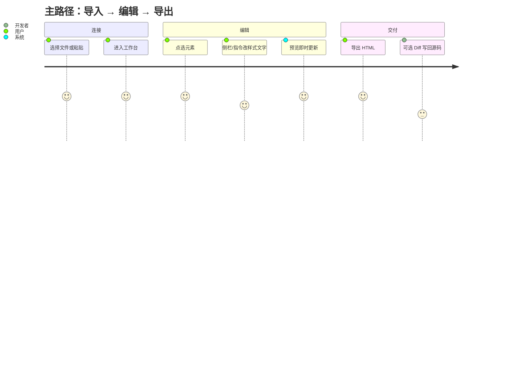
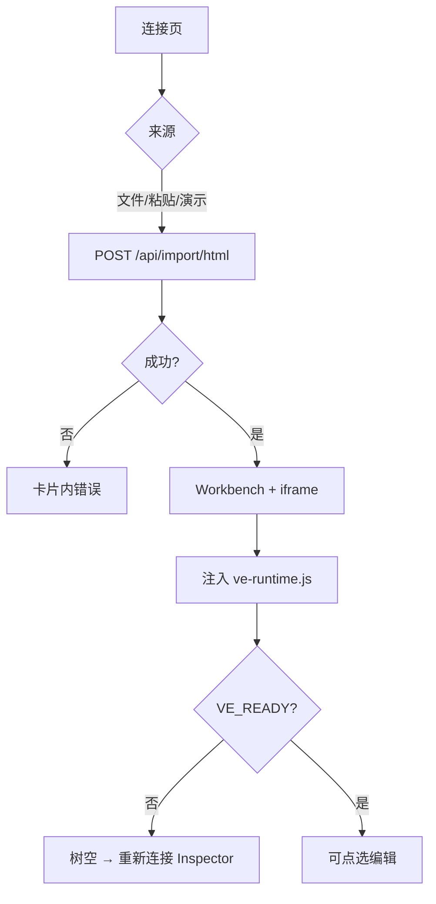

# Visual Editor — 交互原型 / Wireframe Spec

| 文档类型 | 交互原型 / UX 规格 | 版本 | v1.0 |
|----------|-------------------|------|------|
| 状态 | 与当前实现对齐 | 更新 | 2026-05-22 |
| 关联 | [产品需求文档](./产品需求文档.md)、[技术方案](./技术方案.md)、[用户手册](./用户手册.md) |
| 实现参考 | `editor/src/views/*`、`editor/src/components/*` |

本文定义**信息架构、线框、组件状态、用户流与可访问性**。视觉与行为以代码为准；研发改 UI 时须同步本文与 PRD。

---

## 1. 文档目的

| 读者 | 用途 |
|------|------|
| 产品 / 设计 | 评审页面结构、主路径、文案与边界态 |
| 前端 | 实现/改版时的组件状态与交互契约 |
| 测试 | 按用户故事验收 UI 行为 |

**不重复**：协议、部署、API 见 [技术方案](./技术方案.md)；操作步骤见 [用户手册](./用户手册.md)。

---

## 2. 体验目标与设计原则

### 2.1 体验目标

| 目标 | 度量 / 表现 |
|------|-------------|
| 预览即真相 | 中央 iframe 为导入的真实 HTML，非静态 mock |
| 改完即见 | 侧栏变更 → 画布 ≤100ms 级反馈 |
| 路径可追踪 | 面包屑可点父级；侧栏展示 DOM 路径与 nodeId |
| 交付清晰 | 主路径「导出 HTML」；Diff 写盘为扩展能力 |

### 2.2 设计原则

| 原则 | 说明 |
|------|------|
| 编辑不落地 | 未导出前为会话级覆盖；顶栏 / 琥珀条显示 pending 数量 |
| 外壳与内容分离 | Shell 浅/深色默认**不改变**导入页内配色 |
| 渐进披露 | Flex/Grid、媒体、Props 随选中元素与 `display` 出现 |
| 可撤销 | 样式 / 文字 / 媒体均入历史栈，与 pending 并行维护 |

---

## 3. 用户旅程（User Journey）



| 阶段 | 用户意图 | 关键界面 | 成功信号 |
|------|----------|----------|----------|
| 接入 | 把现有 HTML 放进编辑器 | 连接页 | iframe 完整渲染、图层树非空 |
| 探索 | 找到要改的元素 | 画布 + 图层树 + 面包屑 | 选中高亮、右栏有属性 |
| 修改 | 改样式 / 文案 / 媒体 / 布局 | 设计侧栏、指令栏 | 画布变化、pending +1 |
| 校验 | 看日志 / 网络 / 错误 | 底栏调试区 | 错误角标、控制台条目 |
| 交付 | 带走 HTML 或写回仓库 | 顶栏导出 / Diff 抽屉 | 下载 `.html` 或 apply 成功提示 |

---

## 4. 信息架构（IA）

### 4.1 站点地图

```
Visual Editor
├── 连接页 ConnectView
│   ├── Tab：本地文件
│   ├── Tab：粘贴 HTML
│   └── 次要入口：全功能演示
└── 工作台 WorkbenchView
     ├── 顶栏（全局操作）
     ├── 琥珀 pending 条（条件显示）
     ├── 指令栏 CommandBar
     ├── 模式提示条（多选 / 结构 / 检查）
     ├── 主体三栏
     │    ├── 左：图层 ComponentTree（可折叠）
     │    ├── 中：iframe 画布
     │    └── 右：设计 DesignSidebar（可折叠）
     ├── 底栏：面包屑 + DebugDock + 状态角标
     └── 模态：DiffDrawer（变更 Diff）
```

### 4.2 与 PRD 用户故事映射

| PRD ID | 界面落点 |
|--------|----------|
| US-01 | 连接页 Tab + 拖放区 |
| US-02 | 连接页「打开全功能演示」 |
| US-10–16 | 画布 + 设计侧栏 + 指令栏 + 图层结构模式 |
| US-20–21 | DebugDock：控制台 / 网络 |
| US-22 | 顶栏 ThemeToggle |
| US-30–33 | 顶栏导出、撤销重做、DiffDrawer |

---

## 5. Shell 设计系统（Design Tokens）

仅描述**编辑器外壳**；导入页内 Token 来自 `.visualeditorrc.json` 注入，与下表独立。

### 5.1 字体

| Token | 值 | 用途 |
|-------|-----|------|
| `--ve-font` | DM Sans, system-ui | 正文、按钮、侧栏 |
| `--ve-mono` | JetBrains Mono | 路径、nodeId、Diff、控制台 |

### 5.2 颜色（`html[data-theme]`）

| Token | 深色 | 浅色 | 用途 |
|-------|------|------|------|
| `--ve-bg` | `#0d0f12` | `#eef0f4` | 页面背景 |
| `--ve-surface` | `#14171c` | `#ffffff` | 卡片、侧栏 |
| `--ve-surface-2` | `#1a1d23` | `#f4f5f7` | Tab 底、输入底 |
| `--ve-text` | `#e8eaed` | `#111418` | 主文字 |
| `--ve-muted` | `#8b929a` | `#3d444d` | 次要说明 |
| `--ve-accent` | `#3ecf8e` | `#0d9f6e` | 主操作、焦点环 |
| `--ve-accent-dim` | rgba(62,207,142,.15) | rgba(13,159,110,.12) | 悬停、拖放高亮 |
| `--ve-danger` | `#ff6b6b` | `#cf222e` | 错误、失败请求 |
| `--ve-canvas` | `#08090b` | `#e2e5eb` | 画布外框背景 |
| `--ve-iframe-bg` | `#ffffff` | `#ffffff` | iframe 底色 |

### 5.3 布局与圆角

| Token | 值 |
|-------|-----|
| `--ve-radius` | `8px` |
| `--ve-panel-inset` | `0.75rem` |
| 连接卡片最大宽 | `520px` |
| 侧栏折叠状态 | `localStorage`：`ve_panel_left` / `ve_panel_right` |

### 5.4 动效

| 场景 | 时长 | 说明 |
|------|------|------|
| Tab / 按钮 hover | ~150ms | `transition: background, color` |
| 侧栏折叠 | 即时 | 宽度动画可选，当前为布局切换 |
| 导出中 | — | 按钮文案「导出中…」，禁用重复点击 |

---

## 6. 屏幕线框与规格

### 6.1 连接页 `ConnectView`

#### 线框

```
┌─────────────────────────────────────────────┐
│  ◆ Visual Editor                            │
│                                             │
│     开始编辑网页                             │
│     点选元素即可改样式、改文字，改完可导出 HTML。  │
│                                             │
│     ┌──────────────┬──────────────┐         │
│     │  本地文件 ●  │  粘贴 HTML   │         │
│     └──────────────┴──────────────┘         │
│     ┌─────────────────────────────┐         │
│     │  拖放 HTML 或点击选择        │         │
│     └─────────────────────────────┘         │
│     [ 错误提示区 ]                             │
│     [ 打开全功能演示 ]                       │
│     覆盖 Flex/Grid、媒体、网络等             │
└─────────────────────────────────────────────┘
```

#### 交互规格

| 元素 | 默认 | 交互 | 结果 |
|------|------|------|------|
| Tab「本地文件」 | 选中 | 点击 | 显示拖放区；隐藏粘贴表单 |
| Tab「粘贴 HTML」 | — | 点击 | 显示页面名称 + textarea +「导入并打开」 |
| 拖放区 | 虚线边框 | dragover | 边框/背景 accent-dim |
| 拖放区 | — | drop / 选文件 | 校验 `.html/.htm` → `POST /api/import/html` → 进工作台 |
| 粘贴「导入并打开」 | 按钮 primary | click | 校验非空 → 上传 → 进工作台 |
| 全功能演示 | 次要按钮 | click | 内置 `fixtures/ve-feature-test.html` 导入 |
| 全局 loading | — | 导入中 | 按钮禁用；错误显示在卡片内 |

#### 边界态

| 状态 | UI |
|------|-----|
| 空粘贴 | 点击导入 → 内联错误「请输入 HTML」 |
| 错误格式 | 「请选择 .html / .htm 文件」 |
| 服务端失败 | `error` 文案展示在卡片内，可重试 |
| 加载中 | `loading` 禁用操作 |

---

### 6.2 工作台 `WorkbenchView`

#### 线框

```
┌──────────────────────────────────────────────────────────────────┐
│ ◆ 页面名 │ ☀浅色 │ 撤销 重做 │ 变更 Diff │ 导出 HTML │ 更换网页   │
├──────────────────────────────────────────────────────────────────┤
│ ■ N 项未保存变更 …                    [ 查看 Diff ]  （条件显示）   │
├──────────────────────────────────────────────────────────────────┤
│ [指令] 变大 加粗 … │ 输入自然语言… │ 执行 │ 反馈文案               │
├──────────────────────────────────────────────────────────────────┤
│ 模式提示：多选 / 结构模式 / 双击编辑 … （条件显示）                  │
├──────────┬───────────────────────────────────────┬───────────────┤
│ 图层 ⊟   │  ┌─ 画布 iframe ───────────────────┐  │ 设计 ⊟        │
│ 搜索…    │  │  导入 HTML + Inspector 叠加       │  │ 设计 | CSS    │
│ 检查|结构│  │                                 │  │ 分组控件      │
│  ▼ tree  │  └─────────────────────────────────┘  │               │
├──────────┴───────────────────────────────────────┴───────────────┤
│ body > main > …  │  [控制台|网络] 展开区  │  无错误 / N 个错误    │
└──────────────────────────────────────────────────────────────────┘
                    ║ 模态：变更 Diff 抽屉（全屏遮罩） ║
```

#### 顶栏

| 控件 | 状态 | 行为 |
|------|------|------|
| 页面名 | 只读 | `title` 显示完整 `iframeSrc` |
| ThemeToggle | 双态 | 循环浅/深色；**有 importId 时仅改 Shell**（tooltip 说明） |
| 撤销 / 重做 | `disabled` 当栈不可用 | 同步 `restoreSnapshots` |
| 变更 Diff | `disabled` 当 pending=0 | 打开 `DiffDrawer` |
| 导出 HTML | 导出中禁用 | `Ctrl+S` 同等；下载 `{页面名}.html` |
| 更换网页 | 始终可用 | `disconnect` → 连接页 |

#### 琥珀 pending 条

| 条件 | 内容 |
|------|------|
| `pendingCount > 0` | `role="status"`；文案含数量 + 写回/导出提示 |
| 操作 | 「查看 Diff」→ `openDiff` |

#### 指令栏 `CommandBar`

| 元素 | 规格 |
|------|------|
| 快捷芯片 | `变大` `变小` `加粗` `主色` `圆角` `居中` `文字改成…` — 点击填入输入框 |
| 输入框 | placeholder 来自 `NLP_PLACEHOLDER`；支持 Enter 执行 |
| 执行 | 无选中 → 反馈「请先选中至少一个元素」 |
| 多选 | 对 `selectedIds` 批量应用样式意图 |
| 文字 | 含子标签节点 → 提示选纯文本或双击画布 |
| 帮助 | `title` 悬停展示 `NLP_CAPABILITIES` 列表 |

#### 左栏 `ComponentTree`

| 功能 | 交互 |
|------|------|
| 搜索 | 过滤 tag / id / 文本，保留祖先链 |
| 模式切换 | **检查**（点选）/ **结构**（同级拖放重排） |
| 树节点 | 单击选中；展开/折叠；与画布双向高亮 |
| 结构模式 | 拖放仅同级；提示在 `workbench__mode-hint` |
| Runtime 未就绪 | 「重新连接 Inspector」按钮 → `initRuntime` |

#### 右栏 `DesignSidebar`

| Tab | 内容 |
|-----|------|
| **设计** | 按选中元素动态分组（见 §7） |
| **CSS** | 属性表：camelCase 编辑 → kebab 应用 |

**空状态**：未选中 →「点击画布选择元素」。

#### 底栏

| 区域 | 说明 |
|------|------|
| `ElementBreadcrumb` | `body > … > tag`；段可点击选父级 |
| `DebugDock` | Tab：控制台 / 网络；可展开列表；Tab 角标显示错误数 / 失败请求数 |
| 状态角标 | `无错误` 或 `N 个错误`（来自 console error 级） |

---

### 6.3 变更 Diff 抽屉 `DiffDrawer`

#### 线框

```
┌─────────────────────────────────────────────────────────────┐
│ 变更 Diff                                    [关闭] [应用选中] │
│ N 项待应用 · 目标 demo-app / imports/{id}.html               │
├─────────────────────────────────────────────────────────────┤
│ □ file-a    □ file-b                                        │
│ ┌─────────────────┬─────────────────┐                       │
│ │ 原始            │ 修改后           │  GitDiffView 风格      │
│ └─────────────────┴─────────────────┘                       │
│ 备注 [可选]                                                  │
└─────────────────────────────────────────────────────────────┘
```

| 交互 | 行为 |
|------|------|
| 打开 | `openDiff` → `POST /api/diff/preview`；loading 态 |
| 关闭 | `Esc`、遮罩、关闭按钮 → `closeDiff` |
| 勾选文件 | 至少一项才可「应用选中」 |
| 导入页 | 虚拟路径 `imports/{importId}.html`（语义行 diff，非整文件行级 patch） |
| 应用成功 | 提示已写入路径；**不**自动重载 iframe（避免丢编辑） |
| 写盘目标提示 | `fileMap` 配置路径，默认 `demo-app` |

---

## 7. 组件规格（按选中上下文）

### 7.1 设计 Tab 分组

| 分组 | 显示条件 | 主要控件 |
|------|----------|----------|
| 元素头 | 已选中 | `<tag>`、组件名、`path`、`nodeId` |
| 布局 | 始终（选中后） | `display`；`flex` → FlexPanel；`grid` → GridPanel |
| 间距 | 始终 | padding / margin / gap → `SpacingSlider` |
| 颜色 | 始终 | `TokenColorGrid` + `ColorPicker`；非 Token 色可警告 |
| 尺寸 | 始终 | width/height；size 预设（非误显计算像素） |
| 文字 | `textEditable` | textarea；「在画布编辑」→ `startTextEdit` |
| 媒体 | `img`/`audio`/`video` | `MediaPanel`：src/poster/alt + OSS 上传 |
| Props | `data-ve-props` | 动态 key-value 表单 → `VE_APPLY_PROPS` |

### 7.2 FlexPanel / GridPanel

| 控件 | 行为 |
|------|------|
| AlignPicker | 九宫格对齐；justify / align 映射 |
| Grid 列/行 | 滑块 + 数值；gap 同步 |
| 画布叠加 | Runtime `layoutOverlay` 参考线（flex/grid） |

### 7.3 NetworkPanel（只读）

| 列 | 说明 |
|----|------|
| 方法 / URL / 状态 / 耗时 | fetch/XHR/资源 timing |
| 失败行 | 使用 danger 色强调；Tab 角标累计失败数 |

---

## 8. 核心用户流

### 8.1 导入并进入工作台



### 8.2 改样式

1. 点选画布或图层树节点  
2. 右栏改属性 → `VE_APPLY_STYLE`  
3. 画布即时更新 → `pendingChanges` +1 → 可选显示琥珀条  

### 8.3 改文字

| 方式 | 流程 |
|------|------|
| 双击画布 | `contenteditable` → `VE_TEXT_CHANGED` |
| 侧栏 textarea | blur / 提交 → `applyText` |
| 指令栏 | NLP `textIntent` → `applyText` |
| Enter | 可编辑节点 → `startTextEdit` |

### 8.4 导出 HTML

顶栏「导出 HTML」或 `Ctrl+S` → `VE_EXPORT_HTML` → `patchExportedHtmlWithPendingChanges` → 浏览器下载。

### 8.5 主题切换（US-22）

| 场景 | Shell | iframe 预览区 |
|------|-------|----------------|
| 导入页（有 `importId`） | `data-theme` 切换 | **不变**（页面注入 `data-ve-ignore-shell-theme`） |
| 无 importId（极少） | 切换 | 可 `VE_SET_THEME` 同步 |
| 联调页内主题 | — | 在 `<html>` 加 `data-ve-allow-shell-theme="true"` |

---

## 9. 画布与 Inspector 叠加（iframe 内）

由 Runtime 绘制，不在 Shell DOM 内，但属交互规格一部分：

| 视觉 | 含义 |
|------|------|
| 悬停轮廓 | 可点选候选 |
| 选中框 | 当前节点 |
| 多选 | 多节点边框 |
| Flex/Grid 线 | 布局参考（结构模式外也可显示） |
| 文字编辑 | 就地 `contenteditable` 边框 |

---

## 10. 可访问性与键盘

| 要求 | 实现要点 |
|------|----------|
| 焦点可见 | 按钮/输入使用 `outline` / accent 环，禁止裸 `outline-none` |
| 状态播报 | pending 条 `role="status"` |
| 图标按钮 | 顶栏/侧栏带 `title` 或可见文案 |
| 模态 | Diff 打开时 `Esc` 优先关闭抽屉 |

### 快捷键

| 按键 | 上下文 | 行为 |
|------|--------|------|
| `Esc` | Diff 打开 | 关闭 Diff |
| `Esc` | 其它 | 取消选中 |
| `Ctrl+Z` | 工作台 | 撤销 |
| `Ctrl+Y` / `Ctrl+Shift+Z` | 工作台 | 重做 |
| `Ctrl+S` | 工作台 | 导出 HTML |
| `Ctrl+点击` | 画布 | 多选增减 |
| `Enter` | 可编辑且焦点不在 input/textarea | 进入文字编辑 |
| 双击 | 画布文本 | 就地编辑 |

---

## 11. 验收检查清单（UI）

| # | 检查项 |
|---|--------|
| 1 | 连接页双 Tab、拖放、粘贴、全功能演示均可进工作台 |
| 2 | 导入后 5s 内可点选且图层树有节点 |
| 3 | 改样式后画布即时变化且 pending 条出现 |
| 4 | 顶栏主题切换不改变导入页内颜色 |
| 5 | 导出文件单独打开与预览一致（含 NLP/侧栏改动） |
| 6 | Diff 抽屉可开闭；导入页显示 `imports/*.html` |
| 7 | 控制台/网络 Tab 有数据时角标正确 |
| 8 | 侧栏折叠状态刷新后保持（localStorage） |

---

## 12. 修订记录

| 版本 | 日期 | 说明 |
|------|------|------|
| v1.0 | 2026-05-22 | 按 ui-ux-pro-max 重构：旅程、设计令牌、组件状态、边界态、验收清单 |
| v0.3 | 2026-05-19 | 网络 Tab、Flex/Grid、主题策略 |
| v0.1 | — | 初版 |
