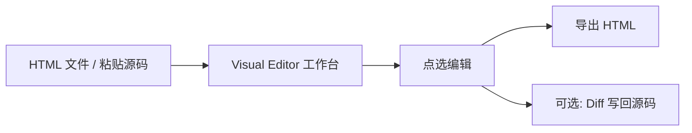

# Visual Editor — 产品宣传与分享

| 文档类型 | 对内宣传 / 评审演示 | 版本 | v1.0 |
|----------|---------------------|------|------|
| 更新 | 2026-05-22 | 读者 | 评审、产品、设计、研发、运维 |
| 用途 | 一页看懂、三分钟能试、飞书粘贴、口头分享 |

细节与验收以 [产品需求文档](./产品需求文档.md) 为准；操作步骤见 [用户手册](./用户手册.md)。

---

## 1. 电梯演讲（30 秒）

**Visual Editor 把「导入 HTML → 点选修改 → 导出 HTML」做成一条短链路。**

适合课件、活动页、落地页等**已经有一份 HTML** 的场景。产品、设计可在真实页面上改字改色；研发仍可选用 Diff 把部分变更写回仓库。不用连本地 dev server，不用在 DevTools 和 IDE 之间来回抄样式。

---

## 2. 一句话与价值主张

### 2.1 主标语（Attention）

**把任意 HTML 拖进浏览器，点哪里改哪里，改完导出就能交付。**

### 2.2 副标语（Interest）

在**真实 DOM** 上编辑，而不是对着截图或画板猜效果；会话内即时预览，导出文件与预览一致。

### 2.3 三条价值（Desire）

| 价值 | 用户得到什么 |
|------|----------------|
| **快** | 侧栏改样式，画布立刻反馈；指令栏当场改标题、主色 |
| **真** | iframe 内是导入的完整页面（含脚本、字体、布局） |
| **稳** | 可撤销、可导出；Shell 主题默认不破坏导入页配色 |

---

## 3. 痛点与转变（PAS）

### 3.1 问题（Problem）

成品 HTML 的微调往往卡在「不会改」或「改起来慢」：文案、配图、间距都要找研发；评审现场只能说「下次改版再做」。

### 3.2 加剧（Agitate）

在 DevTools 里试样式无法沉淀为交付物；连 dev 预览又常遇到跨域、白屏、环境不一致。改完若不能导出独立 HTML，课件与活动页场景仍然绕回发版流程。

### 3.3 方案（Solution）

Visual Editor：**只导入 HTML** → 可视化改 → **导出 HTML** 作为主交付；可选 Diff 写回 monorepo（研发扩展）。

| 以前 | 现在 |
|------|------|
| 调按钮颜色要在 Elements 和 IDE 间往返 | 点选 → 侧栏改色 → 画布即时看见 |
| 课件 / 活动页改文案要找研发 | 双击改字，或「文字改成……」 |
| 换图要改 `src`，还怕脚本里写死旧地址 | 侧栏改媒体 + OSS 上传，导出一并替换 |
| 评审说「间距再大点」难以当场呈现 | 滑块 + 自然语言，当场预览后导出 |

---

## 4. 核心能力（FAB）

### 4.1 导入即编辑

| 维度 | 内容 |
|------|------|
| **Feature** | 本地 `.html` 拖放、粘贴源码、一键全功能演示 |
| **Advantage** | 不依赖 dev server，免跨域与白屏 |
| **Benefit** | 打开浏览器即可试，适合内网评审与课件场景 |

### 4.2 所见即所得

| 维度 | 内容 |
|------|------|
| **Feature** | 图层树、点选 / `Ctrl` 多选、Token 色板、Flex/Grid 专区块、结构拖放 |
| **Advantage** | 比 DevTools 更偏设计向，带撤销与导出 |
| **Benefit** | 非工程师也能在真实页面上完成常见视觉调整 |

### 4.3 说人话也能改

| 维度 | 内容 |
|------|------|
| **Feature** | 指令栏规则 NLP（中英文样式 / 文字意图） |
| **Advantage** | 不依赖外网大模型，响应快、结果可预期 |
| **Benefit** | 评审现场改标题、主色，减少口头需求积压 |

示例：「字号加大」「背景改成主色」「文字改成：欢迎参加本次活动」。

### 4.4 改完能带走

| 维度 | 内容 |
|------|------|
| **Feature** | 导出 HTML（`Ctrl+S`）、撤销 / 重做、变更 Diff |
| **Advantage** | 导出含当前预览样式与媒体地址；Diff 可写回 `fileMap` 路径 |
| **Benefit** | 实施方直接拿 HTML；研发团队可选同步仓库 |

### 4.5 调试一体

| 维度 | 内容 |
|------|------|
| **Feature** | 底栏同步控制台与网络请求（只读） |
| **Advantage** | 改页面时同屏看加载失败与脚本报错 |
| **Benefit** | 减少「改完才发现资源 404」的返工 |

---

## 5. 行动指引（Action）

### 5.1 本机 3 分钟演示（推荐）

```text
1. npm install && npm run build:runtime && npm run dev
2. 浏览器打开 http://localhost:5174
3. 点击「打开全功能演示」
4. 点选标题 → 右侧改颜色 / 双击改字
5. 顶栏「导出 HTML」→ 单独打开下载文件核对
```

### 5.2 测试环境（听众无需装 Node）

访问：`https://{你的域名}/visual-editor/`  
自检：`curl -s https://{你的域名}/visual-editor/api/health`

打包与服务器命令见 [用户手册 §6](./用户手册.md) 或 [docker 部署到测试环境](./docker部署到测试环境.md)。

### 5.3 建议 CTA（分享结束时）

| 听众 | 下一步 |
|------|--------|
| 产品 / 设计 | 本机或测试环境走一遍 §5.1 |
| 研发 | 阅读 [技术方案](./技术方案.md) §5 ADR |
| 运维 | 按 [用户手册](./用户手册.md) 部署并跑 §6.6 验收清单 |

---

## 6. 典型场景

| 场景 | 怎么用 | 谁受益 |
|------|--------|--------|
| 课件 / H5 活动页微调 | 导入 HTML → 改文案、配图、间距 → 导出 | 教研、运营 |
| 设计走查 | 在真实页调色，不对着截图猜 | 设计 |
| 需求评审 | 指令栏当场改标题、主色 | 产品 |
| 前端协作 | 导出 HTML 给实施；或 Diff 写回 demo | 研发 |
| VS Code 用户 | 插件内嵌同一工作台 | 全栈 |

---

## 7. 产品形态



| 维度 | 说明 |
|------|------|
| 形态 | 独立 Web 应用（默认端口 5174） |
| 技术 | TypeScript、React、自研 iframe Inspector |
| 嵌入 | VS Code Webview |
| 部署 | Docker + nginx 子路径 `/visual-editor/` |

---

## 8. 定位对比（如实说明）

| 方案 | Visual Editor 的做法 | 说明 |
|------|------------------------|------|
| Figma / 画板 | 编辑**真实 HTML**（含脚本、字体、DOM） | 不是静态稿 |
| 浏览器 DevTools | **设计向控件** + 图层树 + 导出 + 撤销 | 不是改完即丢 |
| 连本地 dev 预览 | **仅 HTML 导入** | 面向交付物，非 dev 环境 |
| Cursor Browser 等 | 同类运行时编辑方向 | 我们聚焦 HTML 导入闭环与课件场景，可并行参考 |

---

## 9. 界面一览（分享用）

**连接页**：拖文件 / 粘代码 → 一键全功能演示。

**工作台**：

```text
┌ 顶栏：主题 | 撤销重做 | 变更 Diff | 导出 HTML ─────────────┐
├ 图层树 │        真实页面预览（iframe）        │ 设计 / CSS 侧栏 ┤
├ 指令栏：自然语言 + 快捷芯片 ─────────────────────────────────┤
└ 面包屑 | 控制台 | 网络 ───────────────────────────────────────┘
```

顶栏浅/深色**只改编辑器外壳**；导入页配色由页面自身样式决定。线框详见 [交互原型](./交互原型.md)。

---

## 10. 技术可信度（给研发 30 秒）

- iframe 与 Shell 经 **postMessage** 协议通信，变更可追踪、可撤销  
- 导入页**内存托管**（会话级），**导出 HTML** 才落盘交付  
- 支持内网域名、子路径反代；`ve-runtime.js` 可独立构建发布  

实现细节：[技术方案](./技术方案.md)。

---

## 11. FAQ（异议处理）

**Q：改完一定要导出吗？**  
A：是。**导出 HTML** 是保存导入页的主方式。写回 Git 源码是可选能力，见变更 Diff。

**Q：能直接编辑 Vue / React 工程吗？**  
A：当前面向**可导出的 HTML 页面**。组件项目请先导出 HTML 或提供片段。

**Q：会不会把客户页面样式搞乱？**  
A：可随时撤销；导出前均在预览中确认。Shell 主题默认**不**改导入页内配色。

**Q：需要联网或大模型吗？**  
A：本地编辑不依赖 LLM；指令栏为规则引擎。媒体上传 OSS 时需配置 `VE_TOOL_TOKEN` 且内网可达上传接口。

**Q：为什么测试环境不能只部署静态 dist？**  
A：须 Node 提供导入 API 与 runtime 注入，否则树空、无法编辑。见 [用户手册 §6.1](./用户手册.md)。

**Q：和 PRD 验收有什么关系？**  
A：分享演示建议覆盖 E2E-01（导入→编辑→导出一致），见 [产品需求文档 §8.5](./产品需求文档.md)。

---

## 12. 分享话术（可直接使用）

### 12.1 口头 1 分钟

> Visual Editor 是一条很短的链路：**导入 HTML → 点选修改 → 导出 HTML**。  
> 适合课件、活动页这种已经有一份 HTML 的场景。  
> 产品、设计可以在真实页面上改字改色；研发可以用 Diff 把部分变更写回仓库。  
> 我们有全功能演示页，打开浏览器三分钟就能看完核心能力。

### 12.2 评审开场 2 分钟

> 今天介绍的是 Visual Editor，解决的是成品 HTML 微调慢、评审难当场落地的问题。  
> 以前要在 DevTools 和 IDE 之间来回试，现在拖进浏览器点选就能改，改完导出文件就能交付。  
> 我会先走演示：全功能页 → 改颜色改字 → 导出 → 单独打开验证。  
> 技术上我们是 Shell + iframe Inspector，不连 dev server，测试环境已支持 Docker 和 nginx 子路径。  
> 详细验收和边界在 PRD，今天先看主路径是否满足各位场景。

### 12.3 飞书消息（短版，可粘贴）

```text
【Visual Editor】导入 HTML → 点选改样式/文字/媒体 → 导出 HTML 交付。
适合课件、活动页。不连 dev server。
试用：http://localhost:5174 或 https://{域名}/visual-editor/
文档：docs/产品宣传与分享.md | 操作：docs/用户手册.md
```

---

## 13. 幻灯片大纲（可选）

| 页 | 标题 | 要点 |
|----|------|------|
| 1 | 一句话 | §2.1 主标语 |
| 2 | 痛点 | §3 表格「以前 / 现在」 |
| 3 | 演示 | §5.1 五步或录屏 |
| 4 | 能力 | §4 五个 FAB 标题 |
| 5 | 场景 | §6 表格 |
| 6 | 定位 | §8 对比表 |
| 7 | 部署 | §5.2 测试 URL + health |
| 8 | Q&A | §11 FAQ 选 3 条 |

---

## 14. 后续方向（简述）

| 优先级 | 能力 |
|--------|------|
| P1 | 更精准的 AST 源码回写 |
| P2 | 多资源打包导出、协作与版本对比 |

完整 backlog 见 [产品需求文档 §13](./产品需求文档.md)。

---

## 15. 文档索引

| 文档 | 用途 |
|------|------|
| [产品需求文档](./产品需求文档.md) | 范围、用户故事、验收 |
| [交互原型](./交互原型.md) | 线框与交互 |
| [技术方案](./技术方案.md) | 架构与协议 |
| [用户手册](./用户手册.md) | 安装、操作、排错 |
| [文档中心](./README.md) | 四类主文档导航 |
| [项目 README](../README.md) | 克隆与命令 |

---

## 16. 修订记录

| 版本 | 日期 | 说明 |
|------|------|------|
| v1.0 | 2026-05-22 | 按 copywriting（AIDA/PAS/FAB）重构；话术、幻灯片大纲、FAQ 对齐 v1.0 文档体系 |
| v0.4 | 2026-05-19 | 初版对内宣传合并稿 |

---

*内部项目 · 试用与部署问题见 [用户手册](./用户手册.md) · 文档随版本更新*
