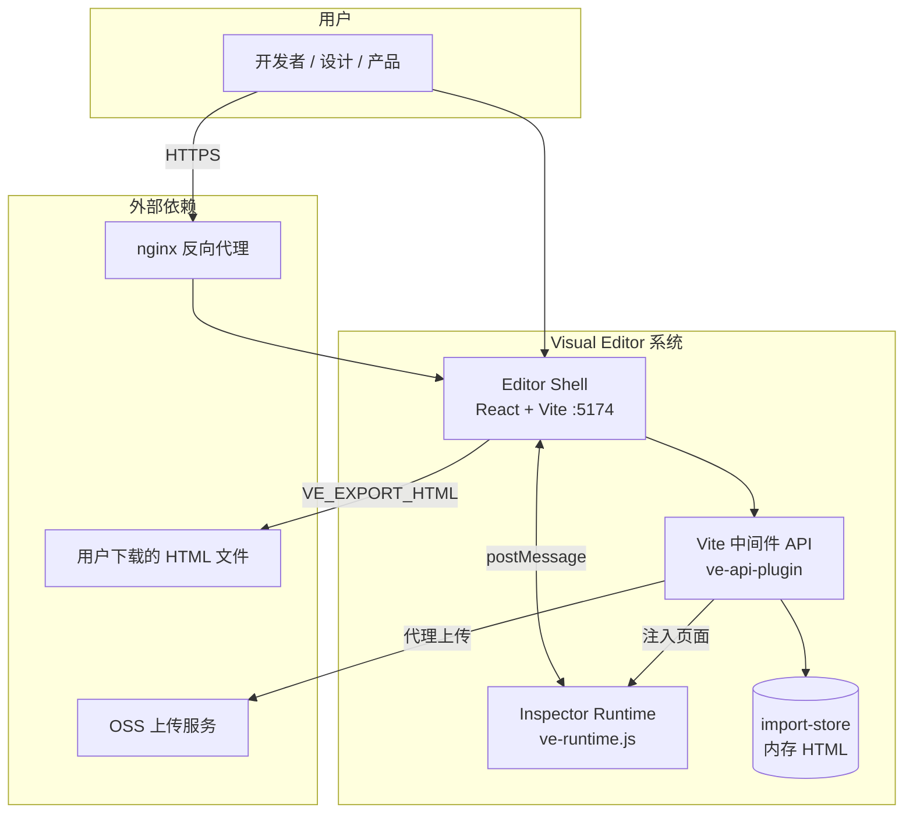
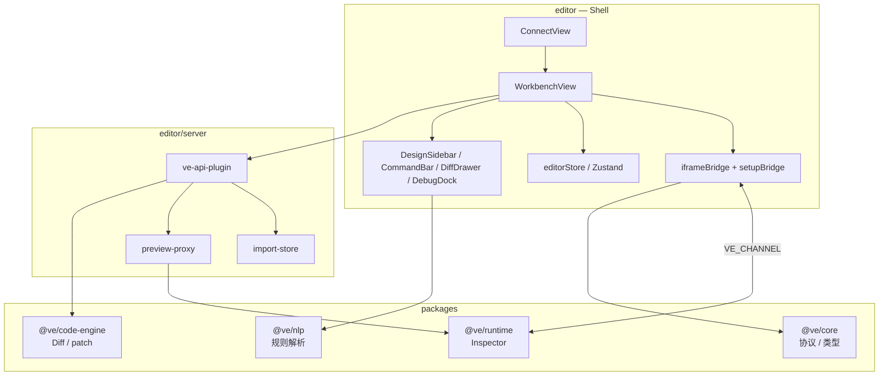
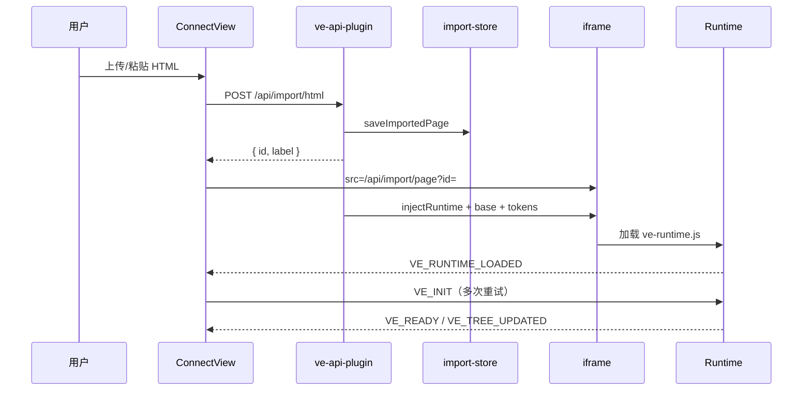
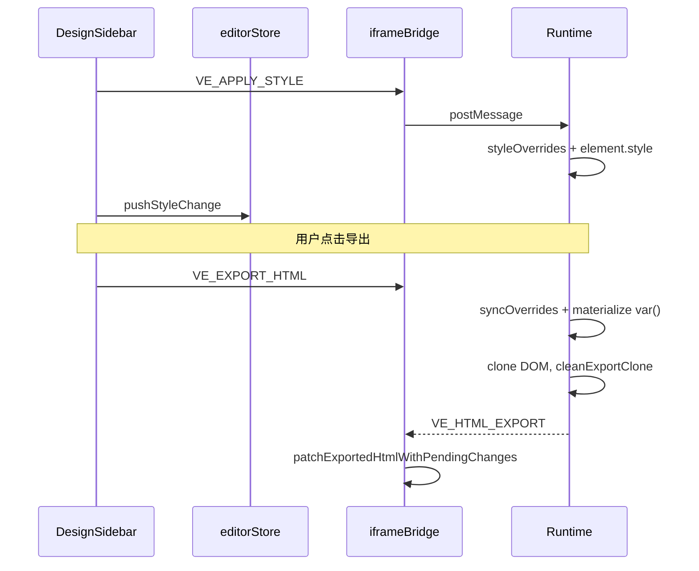

# Visual Editor — 技术方案

| 文档类型 | 技术方案 / 架构设计 | 版本 | v1.0 |
|----------|---------------------|------|------|
| 状态 | 已采纳（与实现对齐） | 更新 | 2026-05-22 |
| 关联 | [产品需求文档](./产品需求文档.md)、[交互原型](./交互原型.md)、[用户手册](./用户手册.md) |

---

## 1. 文档目的与范围

本文描述 Visual Editor 的**系统边界、架构分层、关键决策、接口契约、部署与安全**，供研发、测试与运维评审。

**范围内**：HTML 导入编辑、iframe Inspector、导出 HTML、可选源码 Diff/写盘、测试环境 Docker/nginx 部署。

**范围外**：LLM 自动改码、连接用户本地 dev server、多租户 SaaS、持久化会话库（当前为内存 import-store）。

---

## 2. 需求摘要

### 2.1 功能需求（摘自 PRD）

| 能力域 | 核心能力 |
|--------|----------|
| 导入 | 本地 `.html`、粘贴源码、内置全功能演示页 |
| 编辑 | 点选、图层树、设计/CSS 侧栏、Flex/Grid、Props、媒体、结构拖放 |
| 指令 | 规则引擎 NLP（中英文样式/文字意图） |
| 调试 | 控制台同步、网络请求只读面板 |
| 交付 | 导出 HTML；撤销/重做；变更 Diff（导入页语义 + 可选写回 monorepo） |

### 2.2 非功能需求（NFR）

| 类别 | 目标 | 说明 |
|------|------|------|
| 性能 | 侧栏改样式后画布 **≤100ms** 可见反馈 | 会话内 `inline style`，无 round-trip 写盘 |
| 可用性 | 测试环境 **99%**（内网工具） | 单实例 + Docker 重启策略 |
| 安全 | postMessage 来源校验；写盘路径沙箱 | 见 §8 |
| 可维护性 | npm workspaces + TS 全链路类型 | 协议集中在 `@ve/core` |
| 可部署性 | 支持子路径 `/visual-editor/` | `VE_BASE_PATH` 与 nginx 对齐 |
| 兼容性 | Chromium 系浏览器；Node **20+** 构建/运行 | CentOS 7 建议 Docker |

### 2.3 约束

- **必须**由 Node 进程提供 `/api/*` 与 `ve-runtime.js`，不可仅静态托管 `editor/dist`。
- 导入页会话存**进程内存**（TTL 24h），重启 Node 后需重新导入。
- 主交付为**导出 HTML**，写回 Git 源码为扩展路径，与导入预览解耦。

---

## 3. 系统上下文（C4 — Context）



---

## 4. 逻辑架构（C4 — Container）



### 4.1 组件职责

| 组件 | 技术 | 职责 |
|------|------|------|
| **Editor Shell** | React 19 + Vite 6 | 连接页、工作台 UI、变更栈、Diff 抽屉、导出触发 |
| **iframeBridge** | `window.postMessage` | Shell ↔ Runtime 唯一通道；定时重试 `VE_INIT` |
| **@ve/runtime** | TS → IIFE `ve-runtime.js` | DOM 点选、树同步、样式/文字/媒体应用、导出序列化 |
| **@ve/core** | TS | `SemanticChange`、消息类型、`acceptVePostMessageOrigin` |
| **@ve/nlp** | 纯规则 | 指令栏意图解析（无 LLM） |
| **@ve/code-engine** | TS | unified diff、导入页语义 diff、CSS/TSX 字符串 patch |
| **ve-api-plugin** | Vite `configureServer` / `configurePreviewServer` | 导入 API、健康检查、Diff 预览、OSS 代理、`ve-runtime.js` |
| **import-store** | 内存 `Map` | 导入 HTML 会话；TTL 24h |
| **vscode-extension** | Webview | 嵌入同一 Shell URL（可选） |

---

## 5. 关键架构决策（ADR）

### ADR-001：Web Shell + iframe 预览

| 项 | 内容 |
|----|------|
| **状态** | 已采纳 |
| **背景** | 需在「真实 DOM」上编辑；需支持 VS Code Webview 嵌入。 |
| **决策** | 外层 React Shell，内层 iframe 加载导入页；Inspector 脚本注入 iframe。 |
| **收益** | 与目标页同域加载（经 `/api/import/page`）；隔离 Runtime 崩溃面。 |
| **代价** | 跨上下文通信用 postMessage；需维护 origin 白名单与握手时序。 |
| **备选** | 连接本地 dev URL —— 已弃用（跨域、代理、白屏成本高）。 |

### ADR-002：HTML 导入为主路径（非 dev server）

| 项 | 内容 |
|----|------|
| **状态** | 已采纳 |
| **决策** | `POST /api/import/html` 存会话 → `GET /api/import/page` 注入 Runtime。 |
| **收益** | 课件/活动页「成品 HTML」场景闭环清晰；测试环境可 Docker 统一部署。 |
| **代价** | 会话不持久；大 HTML 占内存；重启丢失。 |
| **备选** | 数据库持久化会话 —— 未做（V2 可考虑）。 |

### ADR-003：postMessage 频道 `visual-editor`

| 项 | 内容 |
|----|------|
| **状态** | 已采纳 |
| **决策** | 所有消息带 `channel: 'visual-editor'`；类型定义在 `@ve/core`。 |
| **安全** | `acceptVePostMessageOrigin()`：localhost、内网段、与当前页同源。 |
| **备选** | `SharedWorker` / `BroadcastChannel` —— 未采用（跨域与嵌入场景支持差）。 |

### ADR-004：会话内预览 + 导出 HTML 交付

| 项 | 内容 |
|----|------|
| **状态** | 已采纳 |
| **决策** | 预览用 `VE_APPLY_*` 写 DOM/inline style；持久化靠 `VE_EXPORT_HTML` 克隆 DOM。 |
| **收益** | 不依赖 monorepo 即可交付；符合课件场景。 |
| **代价** | 导出须固化 `var(--token)`、保留必要 `<style>`；课件内联脚本可能覆盖样式（已做 URL/文本兜底 patch）。 |
| **备选** | 实时写盘 —— 仅作 Diff/apply 扩展。 |

### ADR-005：NLP 规则引擎（非 LLM）

| 项 | 内容 |
|----|------|
| **状态** | 已采纳 |
| **决策** | `@ve/nlp` 正则/关键词映射样式与文字意图。 |
| **收益** | 可离线、可预测、无 token 成本。 |
| **代价** | 覆盖有限；复杂语义需侧栏手动改。 |

### ADR-006：构建顺序 — 先 `@ve/core` 再 `ve-runtime.js`

| 项 | 内容 |
|----|------|
| **状态** | 已采纳 |
| **决策** | `npm run build:runtime` 内先 `build -w @ve/core`，再 esbuild 打包 runtime。 |
| **原因** | runtime 捆绑 `packages/core/dist`；否则 origin 白名单等逻辑过期导致「树空、功能失效」。 |

---

## 6. 核心流程

### 6.1 导入与 Inspector 握手



### 6.2 样式编辑与导出



---

## 7. 数据与状态模型

### 7.1 服务端：导入会话

```typescript
interface ImportedPage {
  id: string;           // imp_*
  html: string;         // 规范化后的完整 HTML
  label: string;
  baseHref: string;
  createdAt: number;    // TTL 24h 清理
}
```

### 7.2 客户端：变更栈

| 状态 | 存储 | 说明 |
|------|------|------|
| `pendingChanges` | Zustand | `SemanticChange[]`，导出/Diff 数据源 |
| `history` / `historyIndex` | Zustand | 撤销/重做快照 |
| `tree` / `selected` | Zustand | 与 Runtime 同步 |
| `styleOverrides` | Runtime 内存 | nodeId → 样式表，导出前固化到 DOM |

### 7.3 配置：`.visualeditorrc.json`

| 字段 | 用途 |
|------|------|
| `tokens` | 注入导入页 `:root` CSS 变量 |
| `fileMap` | Diff/写盘目标文件（如 `demo-app/src/App.tsx`） |

---

## 8. 接口契约

### 8.1 HTTP API（须 Node 进程）

| 方法 | 路径 | 说明 |
|------|------|------|
| GET | `/ve-runtime.js` | Inspector bundle（`Cache-Control: no-store`） |
| POST | `/api/import/html` | body: `{ html, label?, baseHref? }`，≤5MB |
| GET | `/api/import/page?id=` | 返回注入后的完整 HTML |
| GET | `/api/health` | `{ ok: true }` |
| POST | `/api/diff/preview` | body: `{ changes, importId? }` |
| POST | `/api/apply` | 写回 `demo-app/` 下文件（路径沙箱） |
| POST | `/api/upload/oss` | multipart 代理 OSS，≤30MB |

**子路径**：`VE_BASE_PATH=/visual-editor/` 时，插件 `stripPublicBase` 与前端 `appUrl()` 必须与 nginx `location` 一致。

### 8.2 postMessage（频道 `visual-editor`）

完整类型见 `packages/core/src/index.ts`。

| 方向 | 类别 | 代表类型 |
|------|------|----------|
| Shell → Runtime | 控制 | `VE_INIT`、`VE_SET_MODE`、`VE_RESTORE` |
| Shell → Runtime | 编辑 | `VE_APPLY_STYLE`、`VE_APPLY_TEXT`、`VE_APPLY_MEDIA`、`VE_APPLY_PROPS`、`VE_REORDER` |
| Shell → Runtime | 其它 | `VE_EXPORT_HTML`、`VE_HIGHLIGHT`、`VE_SET_THEME` |
| Runtime → Shell | 状态 | `VE_READY`、`VE_TREE_UPDATED`、`VE_SELECT` |
| Runtime → Shell | 变更 | `VE_TEXT_CHANGED`、`VE_REORDERED` |
| Runtime → Shell | 调试 | `VE_CONSOLE`、`VE_NETWORK`、`VE_NETWORK_BATCH` |
| Runtime → Shell | 导出 | `VE_HTML_EXPORT` |

---

## 9. 部署架构

### 9.1 推荐拓扑（测试环境）


| 层级 | 说明 |
|------|------|
| 构建机 | `npm run docker:pack:cn`（国内镜像）→ `visual-editor-docker.tar` |
| node2 | `bash run-on-server.sh`（CentOS 7 需 `seccomp=unconfined`） |
| nginx | `proxy_pass http://127.0.0.1:5174/visual-editor/` |

详见 [用户手册](./用户手册.md) §5、[docker部署到测试环境](./docker部署到测试环境.md)。

### 9.2 不可行方案

| 方案 | 原因 |
|------|------|
| 仅 nginx 静态 `editor/dist` | 无 `/api/import/*`、无服务端注入 |
| 仅 `172.16.x.x:5174` 无 nginx | 可内网直连调试，但不替代正式域名部署 |

---

## 10. 安全设计

| 威胁 | 措施 |
|------|------|
| 恶意 postMessage | `acceptVePostMessageOrigin` + 同源兜底 |
| 任意写盘 | `/api/apply` 仅允许 `demo-app/` 路径 |
| 大文件 DoS | 导入 5MB、上传 30MB 上限 |
| OSS Token 泄露 | `VE_TOOL_TOKEN` 仅服务端；浏览器不持有 |
| XSS 导入页 | 去除导入 HTML 中 CSP meta；用户自行承担导入内容风险（内网工具） |

---

## 11. 故障模式与恢复

| 故障 | 影响 | 缓解 |
|------|------|------|
| Node 进程重启 | 导入会话丢失 | 重新导入；提示用户 |
| `ve-runtime.js` 未构建或 404 | 树空、无法编辑 | `npm run build:runtime`；检查 nginx 是否把 API 当静态 404 |
| postMessage 被拦 | 树空、指令无效 | 更新 core/runtime；检查域名是否在白名单 |
| Docker 139 退出 | 服务不可用 | `seccomp=unconfined`；见 run-on-server.sh |
| 导出无样式 | 打开 HTML 无变量 | 导出前固化 `var()`；保留 design tokens（已实现） |
| nginx 路径不一致 | 空白/MIME 错误 | 统一 `VE_BASE_PATH` 与 `location` |

---

## 12. 演进与扩展点

| 方向 | 现状 | 建议 |
|------|------|------|
| 会话持久化 | 内存 | Redis / 对象存储 + session id |
| 源码回写 | 字符串 patch | AST（Vue/Svelte）或按选择器映射 |
| LLM 指令 | 规则引擎 | 可选接入，输出仍走 `SemanticChange` |
| 多文件站点 | 单 HTML | 资源打包 zip 导出 |

---

## 13. 附录：仓库与构建

```
可视化编辑器/
├── packages/core          # 协议、类型（须先 build）
├── packages/runtime       # Inspector → ve-runtime.js
├── packages/nlp
├── packages/code-engine
├── editor/                # Shell + server + public/ve-runtime.js
├── fixtures/              # 全功能演示 HTML
├── deploy/                # Dockerfile、nginx、run-on-server.sh
└── .visualeditorrc.json
```

```bash
npm run build -w @ve/core && npm run build:runtime
npm run dev                              # 开发
npm run docker:pack:cn                   # 测试镜像（国内）
```

### 功能实现索引（速查）

| 功能 | 入口代码 |
|------|----------|
| 导入 | `ConnectView` → `ve-api-plugin` → `import-store` |
| 点选/树 | `runtime.ts` ↔ `iframeBridge` |
| 样式/Flex/Grid | `DesignSidebar` / `FlexPanel` / `layoutOverlay.ts` |
| NLP | `CommandBar` → `@ve/nlp` |
| 导出 | `exportHtml.ts` → `VE_EXPORT_HTML` |
| Diff | `openDiff` → `buildImportPageDiffs` / `buildPreviewDiffs` |

---

## 14. 修订记录

| 版本 | 日期 | 说明 |
|------|------|------|
| v1.0 | 2026-05-22 | 按架构设计标准重构：需求/NFR、C4、ADR、序列图、故障模式 |
| v0.4 | 2026-05-19 | 初版合并（简表为主） |
